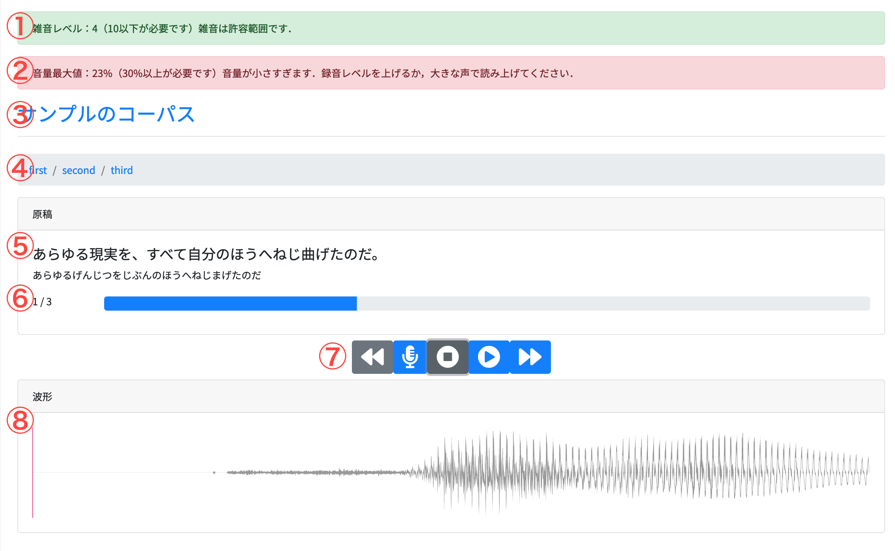

# webrec

An audio recording web app bootstraped by @sahat/hackathon-starter.

## 全体の機能

### コーパス作成者

* コーパス作成
* コーパスの削除
* コーパスのダウンロード

### 録音参加者

* 録音に参加する

## コーパス作成・管理する

コーパスの作成

下記の事項を入力した後に「作成」ボタンを押すと，コーパスを作成できます．

コーパスの名称：必須項目です．コーパスの名称です．

コーパスの説明：必須項目です．コーパスについての説明を書いてください．

原稿：必須項目です．

CSVファイルを読み込む：上記の「原稿」のテキストエリアに直接入力する代わりに，あらかじめ作成しておいたCSVファイルを読み込ませることができます．「Browse」をクリックして，読み込ませたいCSVファイルを指定してください．読み込みが完了すると，「原稿」のテキストエリアにCSVファイルの内容が表示されます．

## 録音する

1. ホーム画面で，「コーパスを録音する」をクリックします．
2. コーパスの一覧が表示されるので，録音するコーパスを選びます．

3．録音を行うコーパスに含まれている原稿の一覧が表示されます．録音が完了していない原稿には，「未完了」と表示されます．録音が完了した原稿は，「録音済」と表示されます．録音をしたい原稿をクリックすると録音画面に遷移します．

4. 録音画面は以下の通りです．

①雑音レベル
②音量最大値
録音を行うと画面の上に出現します．
雑音レベルは録音した音声に含まれる雑音の大きさを，音量最大値は録音した音声の音量を表します．
雑音レベルが適正な値である場合は，緑の吹き出しが出現します．適正な値でない場合は，赤の吹き出しで出現します．
音量最大値も同様です．
雑音レベルと音量最大値が適正な値でないと，録音は完了したとみなされません．

③コーパスのタイトル
現在録音している原稿が含まれるコーパスのタイトルです．

④階層リスト
現在録音している原稿が含まれる階層です．録音する人は，階層を気にする必要はありません．

⑤原稿
読み上げる原稿が表示されます．
大きな字で漢字かなまじり文が，小さいな字でイントネーションが表示されます．

⑥進捗メーター
録音すべき原稿のうち，どこまで録音が完了しているかを表しています．
画像では，録音すべき原稿が3で，そのうち録音が完了しているのは1つであることを表しています．

⑦コントローラー
録音や，録音した音声の再生をするためのコントローラーです．
左から順に，「前の原稿に戻る」「録音開始」「録音停止」「音声再生」「次の原稿に進む」ボタンです．

⑧波形
録音した波形が表示されます．

注意：コントローラーをクリックする代わりに，キーボードからでも録音などの操作が可能です．キーと操作の対応は以下の通りです．
R: 録音開始(Record)
S: 録音停止(Stop)
B: 前の原稿に戻る(Backward)
F: 次の原稿に進む(Forward)
Space: 再生

## 使用言語
* javascript
* pug(jade)
* css

## 使用ライブラリ
* nodejs: サーバーサイドアプリケーション
* hackerthon starter（github:sahat/hackathon-starter）: 認証機能等
* Bootstrap 4: CSSのライブラリ
* Recorderjs：録音機能を担当する
* Wavesurferjs:波形表示に使用
